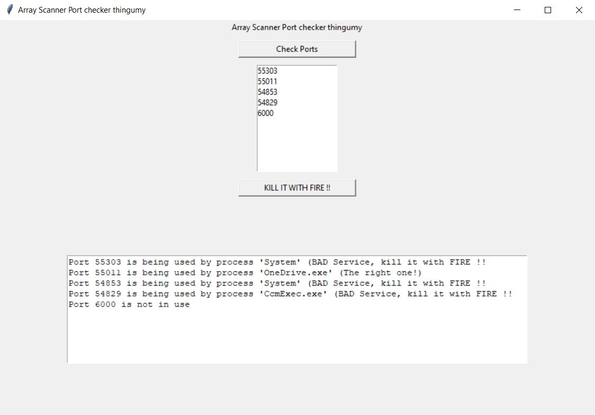

# port-mapping-checker
* Returns the name of services running on specified ports
* Highlights the 'desired' service if running on its expected port
* Provides a simple GUI that allows users to kill selected processes




main.py creates a user-friendly graphical interface to help users monitor and manage services running on specified ports. When users click the 'Check ports' button, the script checks if the specified ports are in use by the desired service and displays the results. Users can then select one or more ports from the list and click the 'Stop Service' button to stop the services running on the selected ports. If no port is selected or there's no active service on a selected port, the script shows an error message to guide the user. This makes it easy for non-technical users to monitor and control services running on their system.

### **Technical summary**
1.	Import the necessary libraries (subprocess, tkinter, and tkinter.messagebox) 
2.	Define the list of ports and desired service: Specify the ports to search for and the desired service (e.g., python.exe).
3.	Create a function run_port_checker(): This function checks if the specified ports are in use by the desired service or not, and updates the output_text widget with the results.
4.	Create a function on_stop_service_clicked(): This function checks if any ports are selected in ports_listbox. If none are selected, it shows an error message. If ports are selected, it calls the stop_service_on_ports() function to stop the services running on the selected ports.
5.	Create a function stop_service_on_ports(): This function takes a list of ports as input, stops the services running on those ports, and returns a list of ports without active processes.
6.	Create the main GUI window: Initialize the tk.Tk() object and set the title and geometry of the main window.
7.	Add GUI elements: Add the banner label, check ports button, ports listbox, stop service button, and output text box to the main window.
8.	Run the main event loop: Call root.mainloop() to run the main event loop, which keeps the GUI responsive to user interactions.

To convert to a standalone app the following.  note that this is intended to be run on a Windoes PC, so compiliing it as-is on a mac will make somethig that wont work unless you get creative with WINE...

```
pyinstaller --onefile port_mapping_checker.py
```

